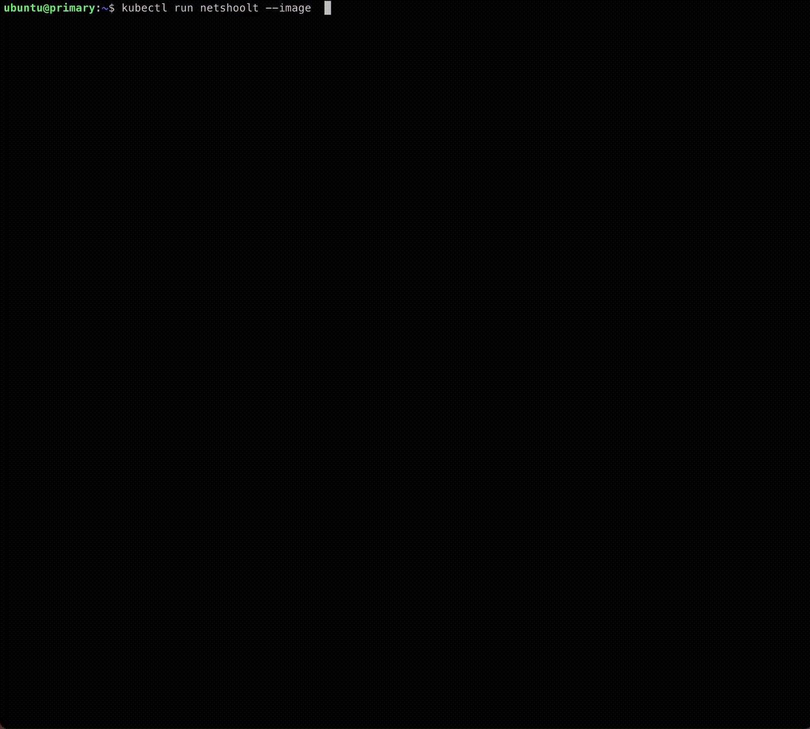

# Looking to exec arbitrary net scope commands in K8s Pod?

## What is podnetenter?
It is a tool allowing to enter into K8s Pod's network(sandbox network).

`podnetenter` can do many useful things, for example
- shoot network problem in Pod with distroless images, using tcpdump/iproute2/iptables provide by podnetenter
- setup network interface even Pod is running

demo: set iptables rule for distroless puase container!


## How to

run Pod
```
kubectl run pause --image zengxu/pause:3.9
```

get pod status
```
k get po pause -o wide
NAME    READY   STATUS    RESTARTS   AGE   IP          NODE 
pause   1/1     Running   0          9s    10.16.0.85  work-1
```
show iproute/iptables using podnetenter
```
apiVersion: v1
kind: Pod
metadata:
  name: show-pause
spec:
  nodeName: work-1
  restartPolicy: OnFailure
  hostPID: true
  containers:
    - name: netenter
      image: zengxu/podnetenter
      args: ["bash", "-c","printf \"===show ip addresses===\n\" && ip addr && printf \"\n===show ip route===\n\" && ip route && echo \"\n===show iptables rules===\" && iptables-legacy-save"]
      env:
        - name: POD_NAME
          value: pause
        - name: NAMESPACE
          value: default
        - name: CONTAINER_RUNTIME_ENDPOINT
          value: "unix:///host/run/containerd/containerd.sock"
      volumeMounts:
        - mountPath: /host/run/containerd/containerd.sock
          name: crisock
      securityContext:
        privileged: true
        allowPrivilegeEscalation: true
  volumes:
    - name: crisock
      hostPath:
        path: /run/containerd/containerd.sock
```
output
```
k logs show-pause
===show ip addresses===
1: lo: <LOOPBACK,UP,LOWER_UP> mtu 65536 qdisc noqueue state UNKNOWN group default qlen 1
    link/loopback 00:00:00:00:00:00 brd 00:00:00:00:00:00
    inet 127.0.0.1/8 scope host lo
       valid_lft forever preferred_lft forever
    inet6 ::1/128 scope host
       valid_lft forever preferred_lft forever
152: eth0@if153: <BROADCAST,MULTICAST,UP,LOWER_UP> mtu 1400 qdisc noqueue state UP group default
    link/ether 00:00:00:37:81:84 brd ff:ff:ff:ff:ff:ff link-netnsid 0
    inet 10.16.0.85/16 brd 10.16.255.255 scope global eth0
       valid_lft forever preferred_lft forever
    inet6 fe80::200:ff:fe37:8184/64 scope link
       valid_lft forever preferred_lft forever

===show ip route===
default via 10.16.0.1 dev eth0
10.16.0.0/16 dev eth0 proto kernel scope link src 10.16.0.85

===show iptables rules===
# Generated by iptables-save v1.8.8 on Fri Nov 18 01:33:48 2022
*mangle
:PREROUTING ACCEPT [1:44]
:INPUT ACCEPT [1:44]
:FORWARD ACCEPT [0:0]
:OUTPUT ACCEPT [1:44]
:POSTROUTING ACCEPT [1:44]
COMMIT
# Completed on Fri Nov 18 01:33:48 2022
# Generated by iptables-save v1.8.8 on Fri Nov 18 01:33:48 2022
*filter
:INPUT ACCEPT [1:44]
:FORWARD ACCEPT [0:0]
:OUTPUT ACCEPT [1:44]
COMMIT
# Completed on Fri Nov 18 01:33:48 2022
# Generated by iptables-save v1.8.8 on Fri Nov 18 01:33:48 2022
*nat
:PREROUTING ACCEPT [0:0]
:INPUT ACCEPT [0:0]
:OUTPUT ACCEPT [1:44]
:POSTROUTING ACCEPT [1:44]
COMMIT
# Completed on Fri Nov 18 01:33:48 2022
```

You can set command as `pause` to make debug Pod long live.

Docker at Worker Node
```
docker run --rm -it --privileged --cgroupns=host -e NAMESPACE=default -e POD_NAME=x -v /proc:/proc -e CONTAINER_RUNTIME_ENDPOINT=unix:///run/containerd/containerd.sock -v /run/containerd/containerd.sock:/run/containerd/containerd.sock zengxu/podnetenter ip a
```

## useful examples

```
# show pod interface list
NAMESPACE=default POD_NAME=x entrypoint.sh ip a

# output Pod netns
NAMESPACE=default POD_NAME=x DRYRUN=true entrypoint.sh

# setup new interface for Pod netns
NETCONFPATH=/etc/cni/net.d/ CNI_PATH=/opt/cni/bin  CAP_ARGS='{"bandwidth": {"ingressRate": 209715200,"ingressBurst": 4294967295,"egressRate": 104857600,"egressBurst": 4294967295}}'  CNI_IFNAME=net1 cnitool add limited-macvlan $(NAMESPACE=default POD_NAME=x DRYRUN=true /entrypoint.sh)
```